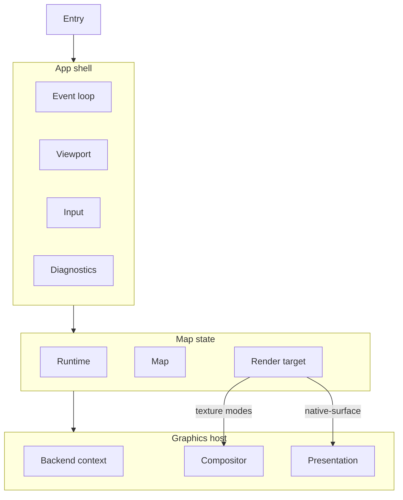
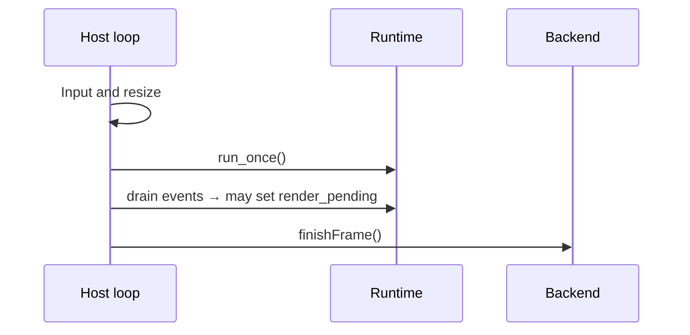
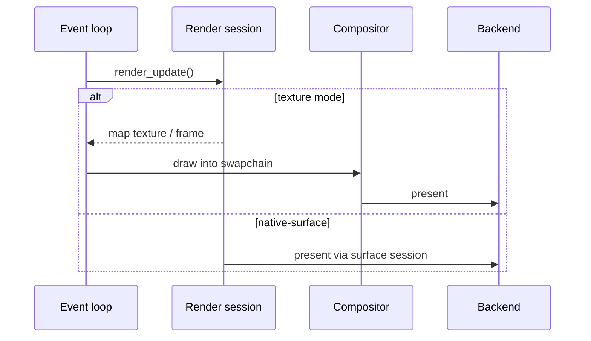

Specification for interactive `*-map` example programs: small apps that exercise
language bindings and render-target integrations through a focused map demo.

The specification has three sections:

1. [Shared baseline](#shared-baseline) — map, render-session, frame-loop, and
   graphics contracts common to every profile.
2. [Desktop profile](#desktop-profile) — windowed desktop hosts with CLI entry
   and keyboard/mouse input.
3. [Mobile profile](#mobile-profile) — embedded view hosts with touch input.

Implement a desktop example by reading Shared baseline and Desktop profile.
Implement a mobile example by reading Shared baseline and Mobile profile.

---

## Implementations

| Example               | Profile | Binding    | Toolkit         | Platforms             | Backends              |
| --------------------- | ------- | ---------- | --------------- | --------------------- | --------------------- |
| `examples/zig-map`    | Desktop | Zig        | SDL3            | Linux, macOS, Windows | Vulkan, Metal, OpenGL |
| `examples/rust-map`   | Desktop | Rust       | winit           | Linux, macOS, Windows | Vulkan, Metal, OpenGL |
| `examples/lwjgl-map`  | Desktop | Kotlin/JVM | GLFW, LWJGL     | Linux, macOS, Windows | Vulkan, Metal, OpenGL |
| `examples/dotnet-map` | Desktop | C#         | GLFW            | Linux, macOS, Windows | Vulkan, Metal, OpenGL |
| `examples/swift-map`  | Desktop | Swift      | AppKit, SwiftUI | macOS                 | Metal                 |

For examples built by native render-backend variant, “Backends” is the union of
supported configured variants. Each native library artifact includes one render
backend. A single run uses one graphics API, selected at build time
(build-variant examples) or at startup from the loaded library (multi-context
examples).

---

## Shared baseline

### Scope

#### What every example provides

- All map, runtime, and render access from application code through the
  project’s language binding for that language.
- Continuous map mode: runtime pumping, event draining, and repaint driven by
  map render events and user input.
- Initial style URL and camera per [Shared defaults](#shared-defaults).
- Camera controls per the active profile ([Desktop profile → Input](#input) or
  [Mobile profile → Input](#input-1)).
- Every graphics API the host toolkit and target platform can support across
  configured variants (Vulkan, Metal, OpenGL/EGL as applicable).
- Render-target coverage per the active profile
  ([Render-target coverage](#render-target-coverage)).
- Startup logging that identifies the active render-target mode and which native
  render backends the loaded library supports.

#### What an example is not

A `*-map` program is a focused map demo. It MUST NOT include automated tests or
packaging/installer UX.

### Shared defaults

#### Style

- Style URL: `https://tiles.openfreemap.org/styles/bright`
- Load the style during map initialization, before the first render.

#### Initial camera

| Field   | Value                                                     |
| ------- | --------------------------------------------------------- |
| Center  | latitude `37.7749`, longitude `-122.4194` (San Francisco) |
| Zoom    | `13.0`                                                    |
| Bearing | `12.0` degrees                                            |
| Pitch   | `30.0` degrees                                            |

Apply with an immediate `jump_to` on startup.

#### Map and runtime

- Runtime cache path: `:memory:` (in-memory).
- Map mode: continuous (`MLN_MAP_MODE_CONTINUOUS`).

### Architecture

#### Overview

Every `*-map` example splits host responsibilities into the same logical
modules. Names differ by language; boundaries MUST NOT be collapsed into a
single monolithic type.



#### Logical modules

| Module           | Responsibility                                                                                                          |
| ---------------- | ----------------------------------------------------------------------------------------------------------------------- |
| App shell        | Profile entry, toolkit lifecycle, main event loop, shutdown ordering.                                                   |
| Viewport         | Map logical size, physical drawable size, and `scale_factor` for `RenderTargetExtent`.                                  |
| Map state        | Owns runtime, map, and active render target; loads style and initial camera.                                            |
| Graphics context | Creates/configures the host presentation surface and owns host graphics API context and presentation resources.         |
| Render target    | Owns the render session and mode-specific resources such as compositors, borrowed textures/images, and acquired frames. |
| Compositor       | Host pass that draws a map-owned or borrowed texture into the swapchain.                                                |
| Input            | Pointer and/or touch → map camera APIs; profile-specific control help.                                                  |
| Diagnostics      | Optional log callback and consistent error messages on failed setup or camera commands.                                 |

Implementations SHOULD mirror this layout in the source tree (separate files or
packages per module).

#### Graphics API and mode matrix

The example architecture MUST model the active graphics API separately from the
active render-target mode. Graphics context code owns API-level resources
(Vulkan, Metal, OpenGL/EGL/WGL as applicable). Render target code owns the
attached `RenderSessionHandle`, mode-specific resources, resize behavior,
`render_update`, and close behavior.

The loaded native library reports one render backend per library artifact
through `mln_supported_render_backend_mask()`. Examples built across native
render-backend variants expose the union of those backends in the
[Implementations](#implementations) table.

Graphics API selection follows one of these patterns:

- **Build-variant examples** compile only the graphics API implementation that
  matches the active native build variant (for example `zig-map`, `rust-map`,
  `swift-map`).
- **Multi-context examples** ship a graphics context per targeted API and select
  the active API at startup from `supportedRenderBackends()` and platform policy
  (for example `lwjgl-map`, `dotnet-map`).

Each process run uses one graphics API. Render-target mode selection follows the
active profile ([Entry](#entry) or [Entry and shell](#entry-and-shell)).

Adding a graphics API or render-target mode MUST require localized changes. Keep
each graphics API and render-target mode in its own variant, class, or submodule
rather than branching ad hoc through shared draw code.

### Lifecycle

#### Startup

Order MUST be:

1. Parse profile entry configuration and validate the selected render mode.
2. Read and log the loaded library's supported native render backends from
   `mln_supported_render_backend_mask()`, then validate that the loaded native
   library supports the graphics API selected for this run; fail fast with a
   readable message if not.
3. Create the host presentation surface and initialize the graphics backend for
   the selected graphics API.
4. Create runtime (`:memory:` cache).
5. Create map with extent from the initial viewport and continuous mode.
6. Load style and apply initial camera.
7. Attach render target for the selected mode.
8. Emit startup information:
   - active render-target mode identifier
   - active render-target status line

On failure after partial setup, release already-created handles in reverse order
(render target → map → runtime → graphics).

#### Shutdown

On host termination or fatal error, close resources in order:

1. Finish or wait on in-flight GPU work if the backend requires it.
2. Render target (compositor and borrowed texture/image before or with the
   session, according to graphics API lifetime rules).
3. Map
4. Runtime
5. Graphics context and host presentation surface.

#### Handle ownership

- One runtime per process (owner thread drives `run_once` / pump).
- One map per runtime for the demo.
- One live render target per map at a time.
- Map configuration (style, camera) uses the map handle; render-target extent
  and present use the render target.

### Frame loop

The C API treats runtime pumping and presentation as separate concerns.
`run_once` advances native scheduler work and fills the event queue; it is not
display-driven. `render_update` draws only when `render_pending` is true.

`*-map` examples integrate both through a **display-paced host loop** on the
owner thread: each iteration always pumps the runtime; it renders only when
needed.

#### Host loop iteration

Each iteration has two phases: pump (always) and render (only when
`render_pending` is true).

1. Handle input and resize (may set `render_pending`).
2. Pump: call `run_once`, drain runtime events, run `finishFrame()`.
3. Render: call `render_update` when `render_pending` is true.



`finishFrame()` runs every iteration: swapchain or surface upkeep, resize
handling, and present hooks as required by the host graphics API.

#### Cadence

While the map is visible and the example is active:

- MUST run at least one host loop iteration per display refresh period.
- MUST subscribe to the host toolkit's display refresh mechanism (for example
  swapchain frame callbacks, `CADisplayLink`, or `Choreographer`) to pace the
  loop.

Display refresh paces the loop; it does not replace `run_once`. Each iteration
MUST call `run_once` exactly once.

When the profile stops the loop (for example mobile background), runtime
progress stalls until the loop resumes.

#### Render (`render_pending`)



Requirements:

- MUST call runtime `run_once` once per host loop iteration while the loop is
  running.
- MUST drain runtime events each iteration and set `render_pending` when:
  - `map_render_update_available` targets this map (new map content to draw), or
  - `map_render_frame_finished` targets this map and `needs_repaint` is true
    (continuous mode needs another frame, for example ongoing camera
    transitions).
- MUST set `render_pending` when input changes the camera.
- MUST call `render_update` only while `render_pending` is true.
- MUST clear `render_pending` after `render_update` returns success.
- On `invalid_state` from `render_update`, leave `render_pending` set and
  continue the pump loop (no frame was drawn yet).

Texture modes: after a successful `render_update`, MUST run the compositor pass
to copy the map texture into the host swapchain before present.

### Viewport

The viewport value MUST contain:

| Field                               | Meaning                                                                   |
| ----------------------------------- | ------------------------------------------------------------------------- |
| `logical_width`, `logical_height`   | Map coordinate extent passed to `MapOptions` / `RenderTargetExtent`.      |
| `physical_width`, `physical_height` | Drawable pixels of the host framebuffer.                                  |
| `scale_factor`                      | Ratio between physical and logical sizes (content scale / pixel density). |

Derivation rules:

- Read logical and physical sizes from the host toolkit after surface creation
  and on every resize or backing-scale change.
- Compute logical dimensions from physical size and scale when the toolkit only
  exposes physical pixels (use `ceil(physical / scale)`, minimum `1`).
- Log viewport changes at informational level with field labels
  `logical=… physical=… scale=…`.

Pass `logical_*` and `scale_factor` to map creation, session attach, and session
`resize`.

### Map state

The map state module owns the runtime, map, and render session handles plus
map-specific setup.

#### Creation

- Create runtime with `:memory:` cache.
- Create map with current viewport extent and continuous mode.
- Load [style URL](#style).
- Apply [initial camera](#initial-camera).
- Attach a render target by dispatching on active graphics API and selected
  mode.

#### Event drain

- Drain all pending runtime events each frame.
- Set `render_pending` for the frame loop when either:
  - `map_render_update_available` targets this map, or
  - `map_render_frame_finished` targets this map and `needs_repaint` is true.

#### Resize API

Expose `resize(viewport)` for the active render target. Resize API-level
resources separately when the graphics context requires it. When the active
render target reports `needsReattachOnResize`, destroy it and attach a
replacement for the same graphics context, map, and mode.

### Render-target modes

Shared baseline defines three render-target modes (discriminant/class, attach
paths, and present behavior). Each example implements only the modes required by
its profile ([Render-target coverage](#render-target-coverage)). Example
architecture MUST model each implemented mode.

#### Mode comparison

| Mode identifier    | C API concept                            | Compositor | Role                                                        |
| ------------------ | ---------------------------------------- | ---------- | ----------------------------------------------------------- |
| `owned-texture`    | Session-owned backend texture            | Required   | Map allocates texture, host samples it.                     |
| `borrowed-texture` | Caller-owned texture borrowed by session | Required   | Host allocates exportable texture; session renders into it. |
| `native-surface`   | Window presentation surface              | None       | Map renders directly to the host presentation target.       |

#### Startup status lines

Startup MUST print the active mode identifier and exactly one line from this
table:

| Mode identifier    | Printed line                                                                                       |
| ------------------ | -------------------------------------------------------------------------------------------------- |
| `owned-texture`    | `render target status: samples MapLibre-owned texture frames into the host swapchain`              |
| `borrowed-texture` | `render target status: renders into a host-owned texture, then samples it into the host swapchain` |
| `native-surface`   | `render target status: renders directly to the host window surface`                                |

#### `owned-texture`

- Attach with the C API owned-texture descriptor for the active graphics API.
- Pass the host graphics context handles required by that descriptor (see
  [Graphics API](#graphics-api)).
- On `render_update`, acquire the frame/image from the session, draw via
  compositor, release/close the frame per the C API frame lifetime rules.

#### `borrowed-texture`

- Host creates an exportable texture sized to the viewport (see
  [Graphics API](#graphics-api)).
- Attach with the borrowed-texture descriptor referencing host-owned handles.
- On `render_update`, sample that texture through the same compositor path as
  `owned-texture`.
- On resize, recreate the host texture and re-attach the session (see
  [Resize mechanics](#resize-mechanics); `needsReattachOnResize` is `true` for
  this mode).

#### `native-surface`

- Attach with the C API surface descriptor for host presentation (see
  [Graphics API](#graphics-api)).
- `render_update` presents through the surface render target directly.
- `drawTexture` MUST NOT be called for this mode.
- On resize, call session `resize` and rebuild host presentation; reattach when
  the host toolkit supplies a new surface handle.

### Compositor shaders

For `owned-texture` and `borrowed-texture`, the host-owned compositor that
samples the map texture into the host swapchain MUST use a fullscreen triangle
covering the viewport:

- Vertex shader: three corners with pass-through UVs spanning the visible
  `[0, 1] × [0, 1]` texture range (large-triangle technique).
- Fragment shader: `texture(map_texture, uv)` (straight copy, standard UV
  orientation).

SPIR-V, MSL, or GLSL source MAY differ by backend; the GPU output MUST match
that pass.

### Resize mechanics

- Recompute viewport on host size or scale changes; skip rendering if extent is
  empty.
- `needsReattachOnResize()` is a render-target method. It returns `true` for
  `borrowed-texture` because the host-owned exportable texture is fixed to the
  viewport size: resize destroys the render target, recreates the texture, and
  attaches again. It returns `false` for `owned-texture` and `native-surface`,
  where resize updates graphics-context resources, compositor resources for
  texture modes, and session extent in place.
- When it returns `true`, use the full reattach path; otherwise resize the
  graphics context and active render target in place.
- Set `render_pending` after any resize.

Profile sections define which host events trigger resize
([Desktop profile → Resize triggers](#resize-triggers) or
[Mobile profile → Resize triggers](#resize-triggers-1)).

### Diagnostics

- SHOULD register a native log callback during startup and clear it on shutdown.
- On setup or camera failure, print a short message including the native status
  and diagnostic strings returned by the C API.
- On startup, emit the items listed in [Startup](#startup) step 8 through the
  profile logging sink.

### Graphics API

Attach descriptors and shared context handles for each graphics API the example
binary targets. Implement only the modes required by the active profile
([Render-target coverage](#render-target-coverage)).

#### Vulkan

- One shared Vulkan context (`VkInstance`, `VkDevice`, queue, and
  `VkSurfaceKHR`) for compositor and render session.
- `owned-texture`: Vulkan owned-texture descriptor with those shared handles.
- `borrowed-texture`: exportable `VkImage` and view sized to the viewport;
  borrowed-texture descriptor.
- `native-surface`: surface / swapchain presentation descriptor for the host
  `VkSurfaceKHR`.

#### Metal

- `native-surface`: Metal surface descriptor for the host `CAMetalLayer`.
- `owned-texture`: Metal owned-texture descriptor; shared device and layer
  handles required by the C API.
- `borrowed-texture`: exportable Metal texture sized to the viewport;
  borrowed-texture descriptor.

#### OpenGL / EGL / WGL

- `native-surface`: OpenGL/EGL/WGL surface descriptor for the host platform GL
  surface.
- `owned-texture`: OpenGL owned-texture descriptor; shared GL context handles
  required by the C API.
- `borrowed-texture`: exportable GL texture sized to the viewport;
  borrowed-texture descriptor.

### Render-target coverage

| Profile | Required modes on every graphics API build variant the example ships |
| ------- | -------------------------------------------------------------------- |
| Desktop | `owned-texture`, `borrowed-texture`, `native-surface`                |
| Mobile  | `native-surface`                                                     |

---

## Desktop profile

### Scope

Desktop `*-map` examples add:

- One top-level resizable map window.
- CLI render-target mode selection across all three modes.
- Keyboard and mouse camera controls.
- Graceful process exit when the user closes the window.

### Entry

#### Render-target selection

The process MUST accept a render-target mode name:

| Mode                          | CLI value          |
| ----------------------------- | ------------------ |
| Session-owned texture         | `owned-texture`    |
| Caller-owned borrowed texture | `borrowed-texture` |
| Native window surface         | `native-surface`   |

The mode is a required positional argument (for example
`zig-map owned-texture`). There is no default mode.

On `--help`, print usage listing the three mode names and exit `0` before
creating a window. On invalid arguments, print usage listing the three mode
names and exit `1` before creating a window.

#### Other flags

The only permitted flag is `--help`. Implementations MUST NOT add other CLI
flags.

### Shell and window

- Initial logical size: `960` × `640` pixels.
- Window MUST be resizable.
- High-DPI / Retina: derive map `RenderTargetExtent` from the window's drawable
  size and content scale (see [Viewport](#viewport)).
- Shutdown triggers on window close.

### Startup logging

On startup, print the items listed in [Startup](#startup) step 8 to stdout, plus
the control help text from [Input](#input) below.

### Input

#### Control scheme

Implementations MUST provide the following interactions and MUST print this help
text once at startup:

```text
Controls:
  left drag: pan
  right drag or Ctrl+left drag: rotate with X, pitch with Y
  scroll: zoom at cursor
  arrows or WASD: pan
  + / -: zoom at center
  Q / E: rotate
  ] / [: pitch
  0: reset pitch and bearing
```

#### Behavioral constants

| Interaction                   | Behavior                                                                                                                                                                               |
| ----------------------------- | -------------------------------------------------------------------------------------------------------------------------------------------------------------------------------------- |
| Left drag                     | `move_by` with pointer delta in logical coordinates.                                                                                                                                   |
| Right drag, or Ctrl+left drag | Adjust bearing by `0.5 × Δx` degrees; adjust pitch by `0.5 × Δy` degrees (same sign convention everywhere).                                                                            |
| Scroll                        | Zoom about cursor: `scale_by(2^(Δ * 0.25), anchor)`. Δ from the toolkit wheel event; scrolling up zooms in (use OS-adjusted deltas as reported—do not undo platform scroll inversion). |
| Arrow keys / WASD             | Pan `120` logical units per key press.                                                                                                                                                 |
| `+` / `-`                     | Zoom `1.25` / `1/1.25` about viewport center.                                                                                                                                          |
| `Q` / `E`                     | Bearing ±`10`° with keyboard animation.                                                                                                                                                |
| `]`                           | Pitch +`5`° (clamped to `[0, 60]`) with animation.                                                                                                                                     |
| `[`                           | Pitch −`5`° (clamped to `[0, 60]`) with animation.                                                                                                                                     |
| `0`                           | Animate bearing and pitch to `0` with keyboard animation.                                                                                                                              |

Keyboard animated moves SHOULD use ~`160` ms duration. Pointer drags use
immediate `move_by` / `jump_to` / `pitch_by`.

On pointer down that starts a drag, cancel in-flight camera transitions before
applying deltas.

Input handlers return whether the camera changed so the frame loop can set
`render_pending`.

### Resize triggers

- Subscribe to window size, framebuffer size, and display-scale / content-scale
  events (as available on the platform).

---

## Mobile profile

### Scope

Mobile `*-map` examples add:

- A full-screen or layout-driven map view embedded in the platform app shell.
- Touch camera controls.
- View lifecycle integration (appear, disappear, foreground, background).

### Lifecycle

Mobile examples keep runtime and map state alive across brief disappear and
background transitions. They tear down only on view destruction or app
termination.

Track view visibility and app foreground separately. Run the display-paced host
loop only while the view is visible and the app is in the foreground.

When the host toolkit destroys or invalidates the presentation surface, detach
the render target. Keep runtime and map handles alive. Reattach when a fresh
surface is available.

| Transition                       | Behavior                                                                                                                                                       |
| -------------------------------- | -------------------------------------------------------------------------------------------------------------------------------------------------------------- |
| View will appear                 | Mark the view visible. If the app is in the foreground, start the host loop, refresh viewport, attach or reattach the render target, and set `render_pending`. |
| View did disappear               | Mark the view not visible. Stop the host loop. Detach the render target when the presentation surface is destroyed or invalidated.                             |
| App foreground                   | Mark the app foreground. If the view is visible, start the host loop, refresh viewport, attach or reattach the render target, and set `render_pending`.        |
| App background                   | Mark the app background. Stop the host loop. Detach the render target when the presentation surface is destroyed or invalidated.                               |
| View destroyed / app termination | Run [Shared shutdown](#shutdown).                                                                                                                              |

### Entry and shell

- The map view fills the available layout area or the screen.
- Derive the initial viewport from the view's layout bounds and content scale
  after the view is on screen.
- Attach `native-surface` for the host `CAMetalLayer`, `VkSurfaceKHR`, or
  platform GL surface supplied by the view.
- Shutdown follows view destruction or app termination.
- Minimal platform bundle files required to run on device or simulator are
  permitted. Store distribution and installer UX remain out of scope.

### Input

Use separate pan, pinch-scale, rotation, and shove recognizers. Pinch and
rotation MAY recognize simultaneously. Shove MUST NOT recognize simultaneously
with pinch or rotation.

#### Control scheme

Implementations MUST provide the following touch interactions:

| Interaction                      | Behavior                                                                                                                                                                                                |
| -------------------------------- | ------------------------------------------------------------------------------------------------------------------------------------------------------------------------------------------------------- |
| One-finger drag                  | `move_by` with pointer delta in logical coordinates.                                                                                                                                                    |
| Pinch                            | On begin, record `zoom₀`. On change, `jump_to` zoom `zoom₀ + log₂(S)` about the gesture centroid, where `S` is the scale recognizer's cumulative scale factor since the gesture began (`1.0` at begin). |
| Two-finger rotate                | Adjust bearing by `−Δθ` degrees, where `Δθ` is the rotation recognizer's delta in degrees since the last update.                                                                                        |
| Two-finger vertical drag (shove) | `pitch -= 0.1 × Δy` degrees (clamp to `[0, 60]`), where `Δy` is the change in average touch Y in logical coordinates since the last update.                                                             |
| Double-tap                       | Zoom `1.25` about the tap location with animation (~`160` ms).                                                                                                                                          |

On any gesture begin, cancel in-flight camera transitions before applying
deltas.

Input handlers return whether the camera changed so the frame loop can set
`render_pending`.

### Resize triggers

- Subscribe to layout changes, orientation changes, safe-area changes, and
  display-scale / content-scale changes (as available on the platform).

### Logging

- Emit [Startup](#startup) step 8 items and viewport diagnostics through the
  platform log sink (for example `OSLog` on Apple platforms or `logcat` on
  Android).
- Control help is not required on mobile.
