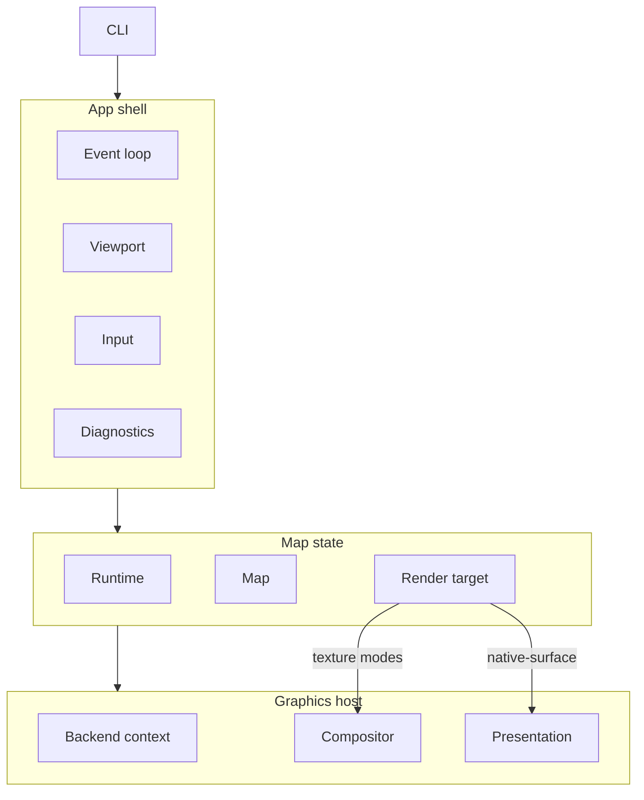
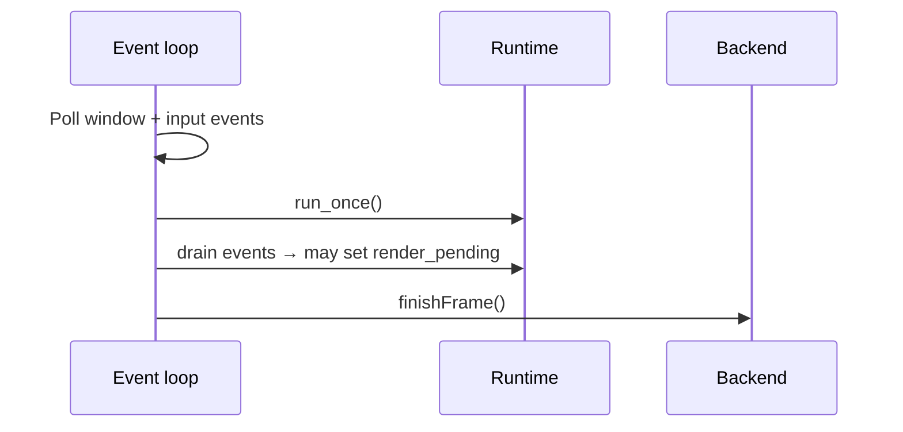
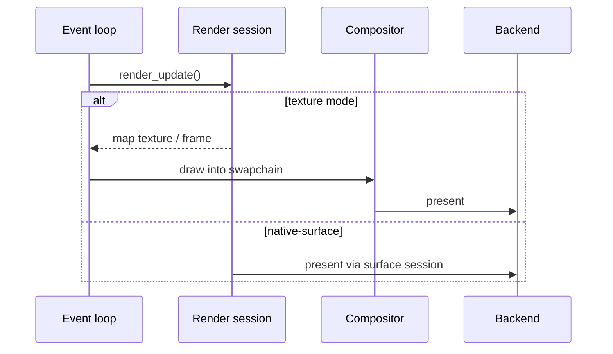

Specification for interactive `*-map` example programs: small apps that exercise
language bindings and render-target integrations through a focused map demo.

## Scope

### What every example provides

- All map, runtime, and render access from application code through the
  project’s language binding for that language.
- One top-level map window with resize support.
- Continuous map mode: runtime pumping, event draining, and repaint driven by
  map render events and user input.
- Initial style URL and camera per [Shared defaults](#shared-defaults).
- Camera controls per [Input](#input).
- Support for the three render-target modes on every graphics API the example
  ships, either in one binary or across configured native render-backend
  variants (see [Render-target modes](#render-target-modes)).
- Every graphics API the window toolkit and target platform can support across
  configured variants (Vulkan, Metal, OpenGL/EGL as applicable).
- Graceful process exit when the user closes the window.
- Startup logging that identifies the selected render-target mode and which
  native render backends the loaded library supports.

### What an example is not

A `*-map` program is a focused map demo. It MUST NOT include automated tests or
packaging/installer UX.

---

## Implementations

| Example              | Binding  | Toolkit         | Platforms             | Backends              |
| -------------------- | -------- | --------------- | --------------------- | --------------------- |
| `examples/zig-map`   | Zig      | SDL3            | Linux, macOS, Windows | Vulkan, Metal, OpenGL |
| `examples/rust-map`  | Rust     | winit           | Linux, macOS, Windows | Vulkan, Metal, OpenGL |
| `examples/lwjgl-map` | Java FFM | GLFW, LWJGL     | Linux, macOS, Windows | Vulkan, Metal, OpenGL |
| `examples/swift-map` | Swift    | AppKit, SwiftUI | macOS                 | Metal                 |

For examples built by native render-backend variant, “Backends” is the union of
supported configured variants. A binary that selects one native render backend
exposes that graphics API for that binary; the example as a whole exposes the
union across configured variants.

---

## Shared defaults

### Style

- Style URL: `https://tiles.openfreemap.org/styles/bright`
- Load the style during map initialization, before the first render.

### Initial camera

| Field   | Value                                                     |
| ------- | --------------------------------------------------------- |
| Center  | latitude `37.7749`, longitude `-122.4194` (San Francisco) |
| Zoom    | `13.0`                                                    |
| Bearing | `12.0` degrees                                            |
| Pitch   | `30.0` degrees                                            |

Apply with an immediate `jump_to` on startup.

### Window

- Initial logical size: `960` × `640` pixels.
- Window MUST be resizable.
- High-DPI / Retina: derive map `RenderTargetExtent` from the window’s drawable
  size and content scale (see [Viewport](#viewport)).

### Map and runtime

- Runtime cache path: `:memory:` (in-memory).
- Map mode: continuous (`MLN_MAP_MODE_CONTINUOUS`).

### Compositor shaders (texture modes)

For `owned-texture` and `borrowed-texture`, the host-owned compositor that
samples the map texture into the window swapchain MUST use a fullscreen triangle
covering the viewport:

- Vertex shader: three corners with pass-through UVs spanning the visible
  `[0, 1] × [0, 1]` texture range (large-triangle technique).
- Fragment shader: `texture(map_texture, uv)` (straight copy, standard UV
  orientation).

SPIR-V, MSL, or GLSL source MAY differ by backend; the GPU output MUST match
that pass.

---

## Command-line interface

### Render-target selection

The process MUST accept a render-target mode name:

| Mode                          | CLI value          |
| ----------------------------- | ------------------ |
| Session-owned texture         | `owned-texture`    |
| Caller-owned borrowed texture | `borrowed-texture` |
| Native window surface         | `native-surface`   |

The mode is a required positional argument (for example
`zig-map owned-texture`). There is no default mode.

On `--help`, print usage listing the three mode names and exit `0` before
creating a window. On invalid arguments, print usage listing the three mode
names and exit `1` before creating a window.

### Other flags

The only permitted flag is `--help`. Implementations MUST NOT add other CLI
flags.

---

## Architecture

### Overview

Every `*-map` example splits host responsibilities into the same logical
modules. Names differ by language; boundaries MUST NOT be collapsed into a
single monolithic type.



### Logical modules

| Module           | Responsibility                                                                                                          |
| ---------------- | ----------------------------------------------------------------------------------------------------------------------- |
| App shell        | Process entry, argument parsing, toolkit lifecycle, main event loop, idle pacing, shutdown ordering.                    |
| Viewport         | Map logical size, physical drawable size, and `scale_factor` for `RenderTargetExtent`.                                  |
| Map state        | Owns runtime, map, and active render target; loads style and initial camera.                                            |
| Graphics context | Creates/configures the top-level window and owns host graphics API context and presentation resources.                  |
| Render target    | Owns the render session and mode-specific resources such as compositors, borrowed textures/images, and acquired frames. |
| Compositor       | Host pass that draws a map-owned or borrowed texture into the swapchain.                                                |
| Input            | Pointer and keyboard → map camera APIs; prints control help once at startup.                                            |
| Diagnostics      | Optional log callback and consistent error messages on failed setup or camera commands.                                 |

Implementations SHOULD mirror this layout in the source tree (separate files or
packages per module).

### Graphics API and mode matrix

The example architecture MUST model the active graphics API separately from the
active render-target mode. Graphics context code owns API-level resources
(Vulkan, Metal, OpenGL/EGL/WGL as applicable). Render target code owns the
attached `RenderSessionHandle`, mode-specific resources, resize behavior,
`render_update`, and close behavior.

When a build variant selects a single native render backend, the example SHOULD
compile only the matching graphics API implementation and its platform glue.
Backend selection can happen at build time; render-target mode selection remains
a runtime CLI choice.

Adding a graphics API or render-target mode MUST require localized changes. Keep
each graphics API and render-target mode in its own variant, class, or submodule
rather than branching ad hoc through shared draw code.

---

## Lifecycle

### Startup

Order MUST be:

1. Parse CLI and validate selected render mode.
2. Read and log the loaded library's supported native render backends from
   `mln_supported_render_backend_mask()`, then validate that the loaded native
   library supports the graphics backend(s) this binary targets; fail fast with
   a readable message if not.
3. Create the top-level window and initialize the graphics backend for the
   selected graphics API.
4. Create runtime (`:memory:` cache).
5. Create map with extent from the initial viewport and continuous mode.
6. Load style and apply initial camera.
7. Attach render target for the selected mode.
8. Print startup information:
   - active render-target mode CLI value
   - active render-target status line
   - control help

On failure after partial setup, release already-created handles in reverse order
(render target → map → runtime → graphics).

### Shutdown

On window close or fatal error, close resources in order:

1. Finish or wait on in-flight GPU work if the backend requires it.
2. Render target (compositor and borrowed texture/image before or with the
   session, according to graphics API lifetime rules).
3. Map
4. Runtime
5. Graphics context and window.

### Handle ownership

- One runtime per process (owner thread drives `run_once` / pump).
- One map per runtime for the demo.
- One live render target per map at a time.
- Map configuration (style, camera) uses the map handle; render-target extent
  and present use the render target.

---

## Frame loop

Each iteration has two phases: pump (always) and render (only when
`render_pending` is true).

### Pump (every iteration)

While polling, handle resize (reattach the render target when required) and
input (may set `render_pending`). Toolkits that use callbacks or timers instead
of a single poll API MUST run one pump iteration per display refresh tick (for
example an `NSTimer` on `swift-map`).



`finishFrame()` runs every pump iteration: swapchain or surface upkeep, resize
handling, and present hooks as required by the host graphics API.

### Render (`render_pending`)



Requirements:

- MUST call runtime `run_once` once per loop iteration while the app is running.
- MUST drain runtime events each iteration and set `render_pending` when:
  - `map_render_update_available` targets this map (new map content to draw), or
  - `map_render_frame_finished` targets this map and `needs_repaint` is true
    (continuous mode needs another frame, for example ongoing camera
    transitions).
- MUST set `render_pending` when input changes the camera.
- MUST call `render_update` only while `render_pending` is true.
- MUST clear `render_pending` after `render_update` returns success.
- On `invalid_state` from `render_update`, leave `render_pending` set and
  continue the pump loop (no frame was drawn yet).
- SHOULD idle-sleep briefly when an iteration makes no progress (event poll,
  render, or runtime work).

Texture modes: after a successful `render_update`, MUST run the compositor pass
to copy the map texture into the window swapchain before present.

---

## Viewport

The viewport value MUST contain:

| Field                               | Meaning                                                                   |
| ----------------------------------- | ------------------------------------------------------------------------- |
| `logical_width`, `logical_height`   | Map coordinate extent passed to `MapOptions` / `RenderTargetExtent`.      |
| `physical_width`, `physical_height` | Drawable pixels of the window framebuffer.                                |
| `scale_factor`                      | Ratio between physical and logical sizes (content scale / pixel density). |

Derivation rules:

- Read logical and physical sizes from the window toolkit after creation and on
  every resize / backing-scale change.
- Compute logical dimensions from physical size and scale when the toolkit only
  exposes physical pixels (use `ceil(physical / scale)`, minimum `1`).
- Log viewport changes at informational level with field labels
  `logical=… physical=… scale=…`.

Pass `logical_*` and `scale_factor` to map creation, session attach, and session
`resize`.

---

## Map state

The map state module owns the runtime, map, and render session handles plus
map-specific setup.

### Creation

- Create runtime with `:memory:` cache.
- Create map with current viewport extent and continuous mode.
- Load [style URL](#style).
- Apply [initial camera](#initial-camera).
- Attach a render target by dispatching on active graphics API and CLI-selected
  mode.

### Event drain

- Drain all pending runtime events each frame.
- Set `render_pending` for the frame loop when either:
  - `map_render_update_available` targets this map, or
  - `map_render_frame_finished` targets this map and `needs_repaint` is true.

### Resize API

Expose `resize(viewport)` for the active render target. Resize API-level
resources separately when the graphics context requires it. When the active
render target reports `needsReattachOnResize`, destroy it and attach a
replacement for the same graphics context, map, and mode.

---

## Render-target modes

Three modes MUST be modeled in every example’s architecture (CLI parsing,
render-target discriminant/class, and attach paths). Each example MUST implement
all three modes on every graphics API the example binary exposes.

### Mode comparison

| CLI value          | C API concept                            | Compositor | Role                                                        |
| ------------------ | ---------------------------------------- | ---------- | ----------------------------------------------------------- |
| `owned-texture`    | Session-owned backend texture            | Required   | Map allocates texture, host samples it.                     |
| `borrowed-texture` | Caller-owned texture borrowed by session | Required   | Host allocates exportable texture; session renders into it. |
| `native-surface`   | Window presentation surface              | None       | Map renders directly to the window presentation target.     |

### Startup status lines

Startup MUST print the active mode’s CLI value and exactly one line from this
table:

| CLI value          | Printed line                                                                                       |
| ------------------ | -------------------------------------------------------------------------------------------------- |
| `owned-texture`    | `render target status: samples MapLibre-owned texture frames into the host swapchain`              |
| `borrowed-texture` | `render target status: renders into a host-owned texture, then samples it into the host swapchain` |
| `native-surface`   | `render target status: renders directly to the host window surface`                                |

### `owned-texture`

- Attach with the C API owned-texture descriptor for the active graphics API.
- Pass the host graphics context handles required by that descriptor (see
  [Graphics API](#graphics-api)).
- On `render_update`, acquire the frame/image from the session, draw via
  compositor, release/close the frame per the C API frame lifetime rules.

### `borrowed-texture`

- Host creates an exportable texture sized to the viewport (see
  [Graphics API](#graphics-api)).
- Attach with the borrowed-texture descriptor referencing host-owned handles.
- On `render_update`, sample that texture through the same compositor path as
  `owned-texture`.
- On resize, recreate the host texture and re-attach the session (see
  [Resize](#resize); `needsReattachOnResize` is `true` for this mode).

### `native-surface`

- Attach with the C API surface descriptor for window presentation (see
  [Graphics API](#graphics-api)).
- `render_update` presents through the surface render target directly.
- `drawTexture` MUST NOT be called for this mode.
- On resize, call session `resize` and rebuild host presentation; reattach when
  the window toolkit supplies a new surface handle.

---

## Resize

- Subscribe to window size, framebuffer size, and display-scale / content-scale
  events (as available on the platform).
- Recompute viewport; skip rendering if extent is empty.
- `needsReattachOnResize()` is a render-target method. It returns `true` for
  `borrowed-texture` because the host-owned exportable texture is fixed to the
  viewport size: resize destroys the render target, recreates the texture, and
  attaches again. It returns `false` for `owned-texture` and `native-surface`,
  where resize updates graphics-context resources, compositor resources for
  texture modes, and session extent in place.
- When it returns `true`, use the full reattach path; otherwise resize the
  graphics context and active render target in place.
- Set `render_pending` after any resize.

---

## Input

### Control scheme

Implementations MUST provide the following interactions and MUST print this help
text once at startup:

```text
Controls:
  left drag: pan
  right drag or Ctrl+left drag: rotate with X, pitch with Y
  scroll: zoom at cursor
  arrows or WASD: pan
  + / -: zoom at center
  Q / E: rotate
  ] / [: pitch
  0: reset pitch and bearing
```

### Behavioral constants

| Interaction                   | Behavior                                                                                                                                                                               |
| ----------------------------- | -------------------------------------------------------------------------------------------------------------------------------------------------------------------------------------- |
| Left drag                     | `move_by` with pointer delta in logical coordinates.                                                                                                                                   |
| Right drag, or Ctrl+left drag | Adjust bearing by `0.5 × Δx` degrees; adjust pitch by `0.5 × Δy` degrees (same sign convention everywhere).                                                                            |
| Scroll                        | Zoom about cursor: `scale_by(2^(Δ * 0.25), anchor)`. Δ from the toolkit wheel event; scrolling up zooms in (use OS-adjusted deltas as reported—do not undo platform scroll inversion). |
| Arrow keys / WASD             | Pan `120` logical units per key press.                                                                                                                                                 |
| `+` / `-`                     | Zoom `1.25` / `1/1.25` about viewport center.                                                                                                                                          |
| `Q` / `E`                     | Bearing ±`10`° with keyboard animation.                                                                                                                                                |
| `]`                           | Pitch +`5`° (clamped to `[0, 60]`) with animation.                                                                                                                                     |
| `[`                           | Pitch −`5`° (clamped to `[0, 60]`) with animation.                                                                                                                                     |
| `0`                           | Animate bearing and pitch to `0` with keyboard animation.                                                                                                                              |

Keyboard animated moves SHOULD use ~`160` ms duration. Pointer drags use
immediate `move_by` / `jump_to` / `pitch_by`.

On pointer down that starts a drag, cancel in-flight camera transitions before
applying deltas.

Input handlers return whether the camera changed so the frame loop can set
`render_pending`.

---

## Diagnostics

- SHOULD register a native log callback during startup and clear it on shutdown.
- On setup or camera failure, print a short message including the native status
  and diagnostic strings returned by the C API.
- On startup, print the three items listed in [Startup](#startup) step 8.

---

## Graphics API

Each example MUST expose every API below that its toolkit and platform can
support, and MUST implement all three render-target modes on each exposed API.
Attach descriptors and shared context handles:

### Vulkan

- One shared Vulkan context (`VkInstance`, `VkDevice`, queue, and
  `VkSurfaceKHR`) for compositor and render session.
- `owned-texture`: Vulkan owned-texture descriptor with those shared handles.
- `borrowed-texture`: exportable `VkImage` and view sized to the viewport;
  borrowed-texture descriptor.
- `native-surface`: surface / swapchain presentation descriptor for the window
  `VkSurfaceKHR`.

### Metal

- `native-surface`: Metal surface descriptor for the window `CAMetalLayer`.
- `owned-texture`: Metal owned-texture descriptor; shared device and layer
  handles required by the C API.
- `borrowed-texture`: exportable Metal texture sized to the viewport;
  borrowed-texture descriptor.

### OpenGL / EGL / WGL

- `native-surface`: OpenGL/EGL/WGL surface descriptor for the window’s platform
  GL surface.
- `owned-texture`: OpenGL owned-texture descriptor; shared GL context handles
  required by the C API.
- `borrowed-texture`: exportable GL texture sized to the viewport;
  borrowed-texture descriptor.
